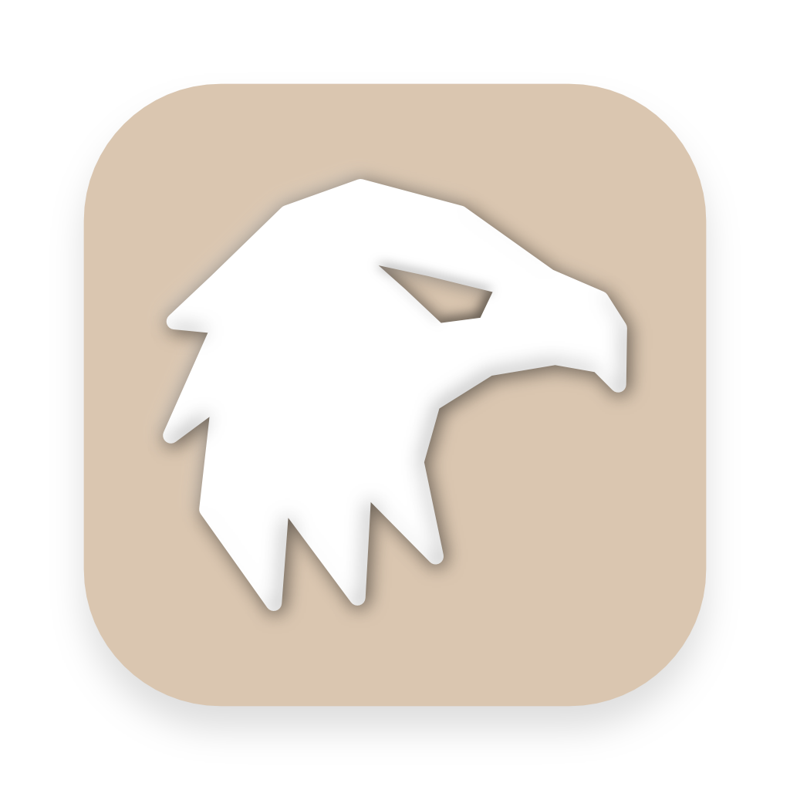

<p align="center"></p>

# 🦅 Peregrine

Peregrine is a rapid, append-only logging and note-taking app, inspired by thesephist's [Inc](https://github.com/thesephist/inc). 

<p align="center"></p>

## Features
- Desktop and mobile support
- Store entries as readable JSON
- Full markdown support (including images and $\LaTeX$)
- Powerful filtering using tags or search
- Extensive keyboard shortcut and menu bar support
- Smooth, responsive performance even with hundreds of entries
- More to come! (encryption, linking, prebuilt packages, more filters...)

### Build from Source
Prebuilt app packages for the latest version are not yet supported. Please build from source. The Flutter SDK is required to build Peregrine.

```bash
git clone git@github.com:ThatNerdSquared/peregrine.git
git clone git@github.com:ThatNerdSquared/pret_a_porter.git # private dependency
cd peregrine
flutter run # to run in dev mode
flutter build [platform] # platforms: macOS (verified), Windows, Linux, iOS (verified), Android
```


## Other Details
- What's the idea behind Peregrine?
    - I'd suggest checking out Linus' [original article on incremental note-taking](https://thesephist.com/posts/inc/); his project based on that idea, Inc, is what inspired me to build Peregrine. I wanted to explore how version control and append-only notes affect our thinking, and I built a tool to experiment with these ideas.
- What's the stack?
    - Flutter and Dart. This is my favourite GUI stack for numerous reasons - I like the Dart language and Flutter is an excellent GUI framework for building cross-platform apps without sacrificing performance or user experience.
- Why Peregrine?
    - [Peregrine falcons](https://en.wikipedia.org/wiki/Peregrine_falcon) are known for their speed - I wanted this app to allow rapid, iterative logging, and the name felt right!
- If you enjoy using Peregrine and want to support further development, feel free to donate below!

<a href="https://www.buymeacoffee.com/nathanyeung" target="_blank"></a>
