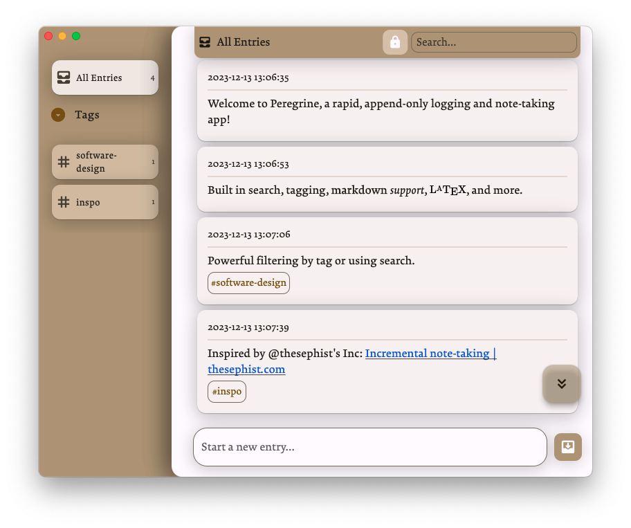

# Peregrine

Peregrine is a rapid, append-only logging and note-taking app, inspired by thesephist's [Inc](https://github.com/thesephist/inc). 



## Installing
Right now Peregrine runs via a Python install on your computer, but I'm hoping to provided pre-packaged binaries and app packages soon. Windows, macOS, and Linux will be supported but only macOS has been tested as of yet.
```bash
git clone git@github.com:ThatNerdSquared/peregrine.git
cd peregrine
pip3 install -r requirements.txt
make run
```

## Features
I'm iterating on Peregrine rapidly, so if a feature you'd like isn't checked off yet, come back in a week and it might be done.
- [x] Append-only note-taking
- [x] Rapid text input that automatically records the date and time (down to the seconds) of each entry
- [x] Fast and light GUI
- [ ] Packaged apps for Windows/macOS/Linux using PyInstaller
- [ ] Tag support (can tag entries and create views with filters for certain tags)
- [ ] Markdown, emoji, and syntax highlighting support
- [ ] Light/dark themes
- [ ] Automatically export logs to .md/.json/.docx/.pdf files
- [ ] Automatically create and update webpage with entries tagged #public

## Other Details
- What's the idea behind Peregrine?
    - I'd suggest checking out Linus' [original article on incremental note-taking](https://thesephist.com/posts/inc/); his project based on that idea, Inc, is what inspired me to build Peregrine.
- What did you build this with?
    - Python, PySide6, and Qt6! I'm most comfortable with Python and also wanted to avoid Electron for an app that needed to be this fast.
- ... peregrine?
    - Yup, [peregrine falcons](https://en.wikipedia.org/wiki/Peregrine_falcon), which are both cool and fast (hopefully like this app)!
- If you enjoy using Peregrine and/or want to support further develop, feel free to [donate!](https://www.buymeacoffee.com/nathanyeung)
